# Домашнее задание к занятию «Введение в Terraform - Викторов Михаил»

## Чек-лист

Скачан и установлен Terraform. Версия выбрана из ветки 1.12.x

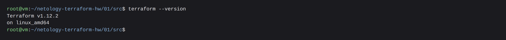

---

## Задание 1

### 1. Скачать зависимости проекта

Скачаны `kreuzwerker/docker v4.5.0` и `hashicorp/random v3.9.0`.

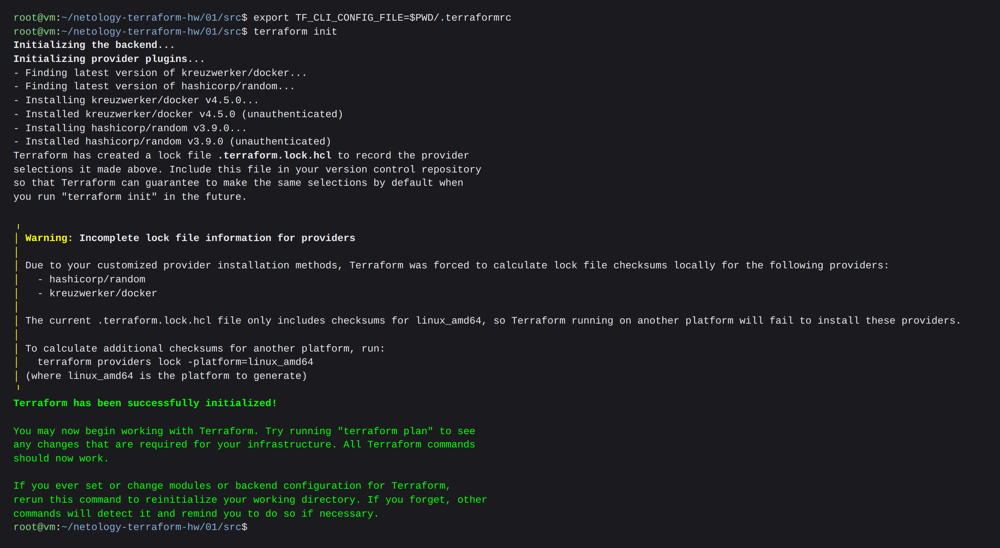


### 2. В каком файле допустимо хранить секреты?

**`personal.auto.tfvars`**

В `.gitignore` последней строкой стоит:

```gitignore
# own secret vars store.
personal.auto.tfvars
```

То есть этот файл не попадает в git, а Terraform подхватывает его автоматически. Туда и кладут
логины, пароли, токены.

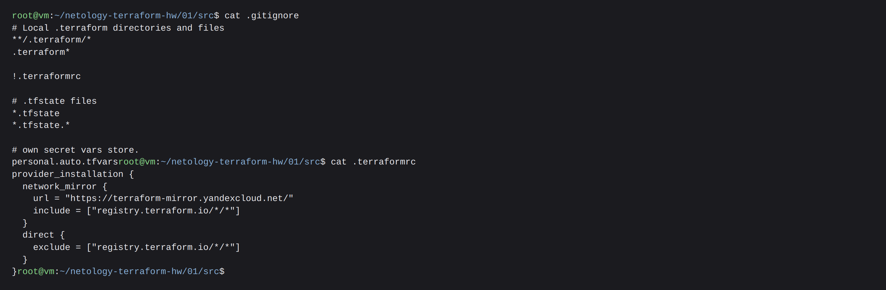

### 3. Секрет в state-файле

```bash
terraform apply -auto-approve
```

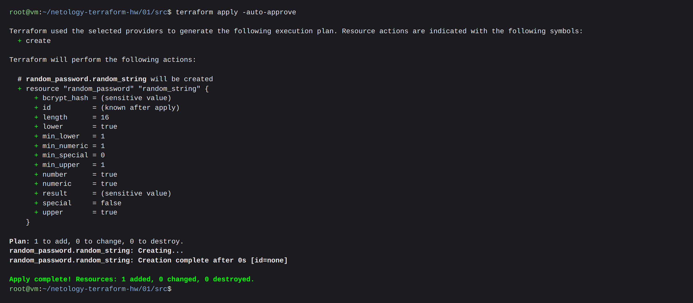

**Ответ: ключ `result`, значение `j1Zf0F1C11M4UkFR`**

```json
"bcrypt_hash": "$2a$10$i/allaB6h6uGbGjmSrkvgePdsW6ts3V/DfMW6xTfof8Y2sVzK4Oma",
"result": "j1Zf0F1C11M4UkFR",
```

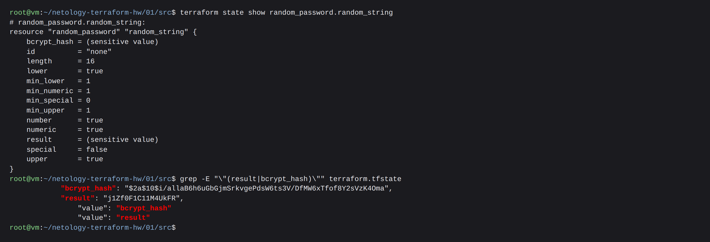

### 4. `terraform validate` и ошибки

Снимаем комментарий с блока (строки `/*` и `*/`):

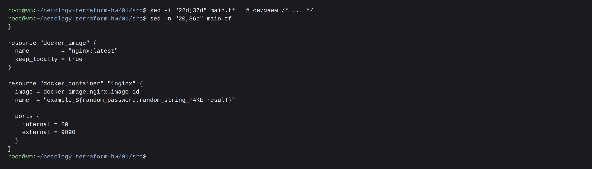

`terraform validate` находит две синтаксические ошибки:

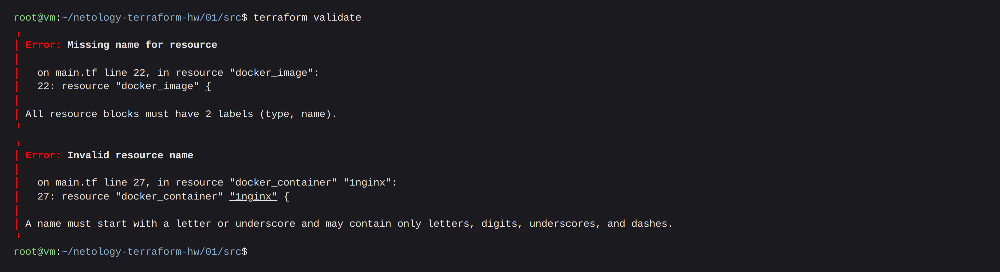

**Ошибка 1 - `resource "docker_image" {`: у блока нет второй метки.**
Блок `resource` всегда описывается двумя метками - тип и имя (`All resource blocks must have
2 labels (type, name)`). Кроме того, ниже по коду на этот ресурс
уже есть ссылка `docker_image.nginx.image_id`.

**Ошибка 2 - `resource "docker_container" "1nginx"`: имя начинается с цифры.**
Идентификатор в Terraform должен начинаться с буквы или подчёркивания.

После исправления меток проявляется третья ошибка:

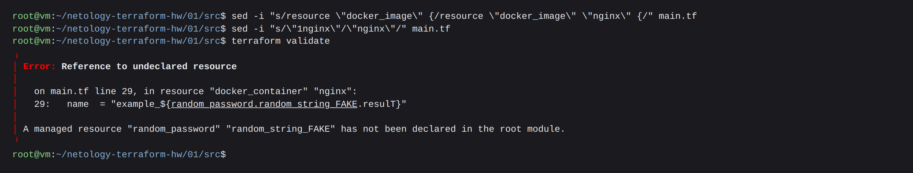

**Ошибка 3 - `random_password.random_string_FAKE.resulT`.** Здесь сразу два дефекта:
ресурса с именем `random_string_FAKE` в модуле нет, а атрибут называется `result` - HCL чувствителен
к регистру, `resulT` не существует.

Исправления:

```hcl
resource "docker_image" "nginx" {          # была потеряна метка с именем ресурса
  name         = "nginx:latest"
  keep_locally = true
}

resource "docker_container" "nginx" {      # было "1nginx" - имя не может начинаться с цифры
  image = docker_image.nginx.image_id
  name  = "example_${random_password.random_string.result}"   # было random_string_FAKE.resulT

  ports {
    internal = 80
    external = 9090
  }
}
```

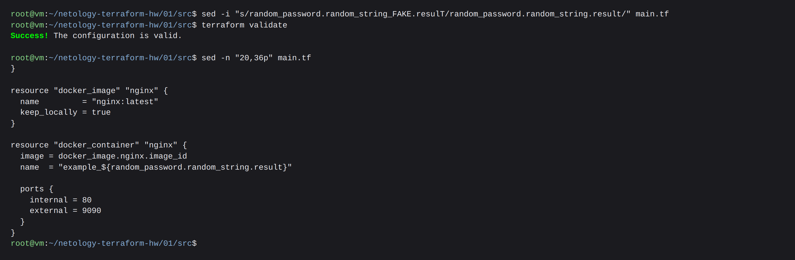

### 5. Выполнение кода

```bash
terraform apply -auto-approve
```

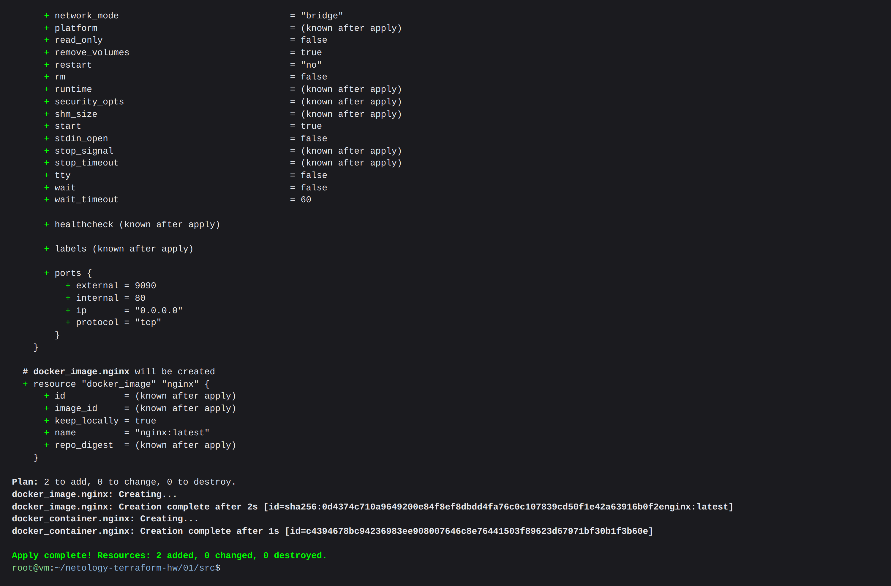

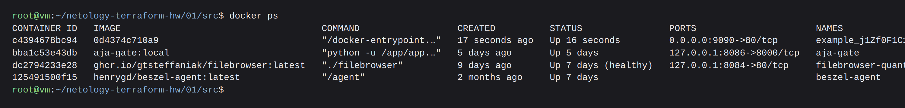

### 6. Переименование контейнера в `hello_world`

```hcl
resource "docker_container" "nginx" {
  image = docker_image.nginx.image_id
  name  = "hello_world"
  ...
}
```

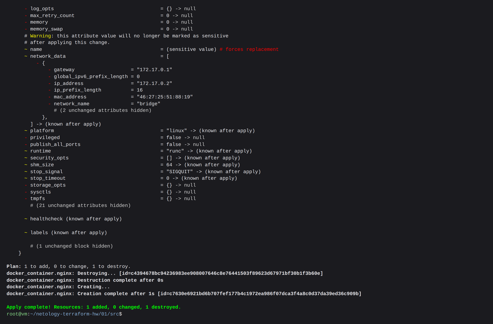

Обращаем внимание на план: `1 to add, 0 to change, 1 to destroy`. Имя контейнера -
неизменяемый атрибут, поэтому Terraform **уничтожил старый контейнер и создал
новый**, а не переименовал его.

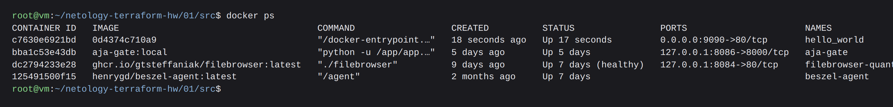

**`-auto-approve`.** Ключ пропускает интерактивное подтверждение плана -
Terraform применяет изменения сразу, не показав их человеку на утверждение. В примере
выше это стоило бы простоя: правка одного поля `name` привела к уничтожению работающего
контейнера. Еще один риск - устаревший план: без `-auto-approve` вы читаете, что именно
будет сделано, с ним же изменения из чужого `apply` уезжают в прод молча.

**Зачем он нужен.** Для неинтерактивных сценариев, где отвечать `yes` некому.

### 7. Уничтожение ресурсов

```bash
terraform destroy -auto-approve
```

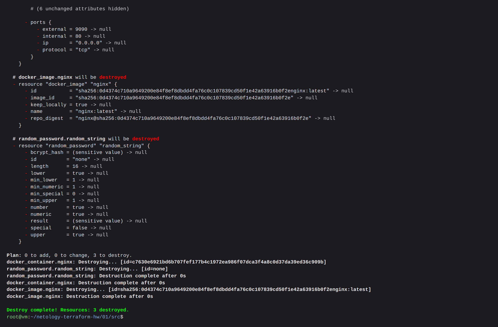

Все три ресурса удалены.

**Содержимое `terraform.tfstate` после destroy:**

```json
{
  "version": 4,
  "terraform_version": "1.12.2",
  "serial": 11,
  "lineage": "ea9cbfdd-9931-2849-a37d-9833209e4374",
  "outputs": {},
  "resources": [],
  "check_results": null
}
```

Файл остаётся на месте, но список `resources` пуст.

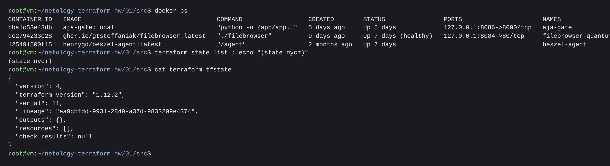

### 8. Почему при этом не был удалён docker-образ `nginx:latest`

**В коде** за это отвечает аргумент в ресурсе `docker_image`:

```hcl
resource "docker_image" "nginx" {
  name         = "nginx:latest"
  keep_locally = true      # <-- образ остаётся в локальном хранилище docker
}
```

**В документации** провайдера [kreuzwerker/docker → resource `docker_image`](https://library.tf/providers/kreuzwerker/docker/latest/docs/resources/image),
раздел Optional:

> `keep_locally` (Boolean) If true, then the Docker image won't be deleted on destroy operation.
> If this is false, it will delete the image from the docker local storage on destroy operation.

Именно поэтому при `destroy` Terraform убрал образ только из state, а `docker images nginx`
по-прежнему показывает `nginx:latest`:

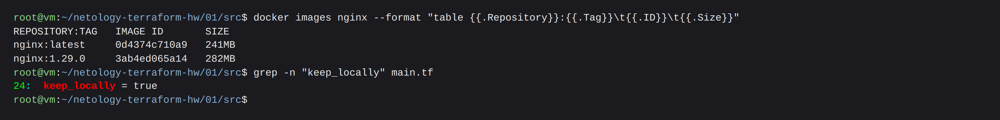
